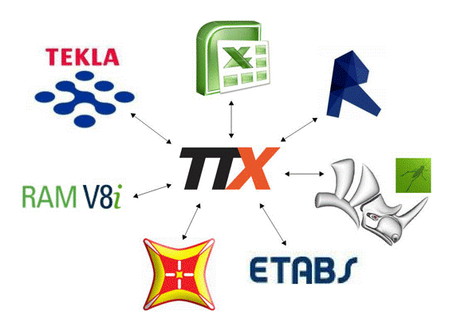

# What is TTX-Cloud? 
Architects and Engineers need to utilize a variety of 3D modeling platforms in order to iterate through the building design process. 
This leads to large amounts of disparate information, which becomes increasingly difficult to manage. 

## The single source of truth for BIM data
TTX-Cloud is a cloud-based platform that enables version control and design collaboration across multiple BIM and analysis programs.

## Interoperabilty
Every 3D modeling program has a different way to represent building elements. TTX-Cloud synchronizes analysis data and geometry between various modeling programs, while respecting their specific standards. More details [here](supported_elements.md).

##Version Control
Every architectural project undergoes many design iterations. TTX-Cloud is developed to keep track of every decision during the design process.

##Model Insight
3D models contain lots of inaccessible information. TTX brings transparency into the design process by offering insight through querying, visualizing, comparing and modifying model data.
 