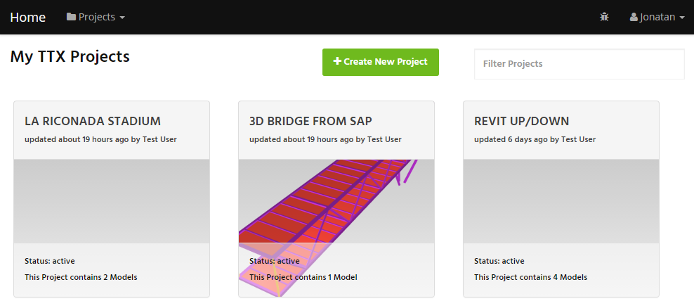
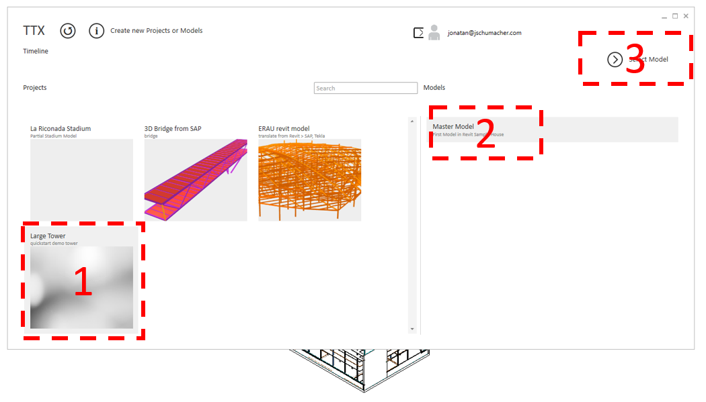
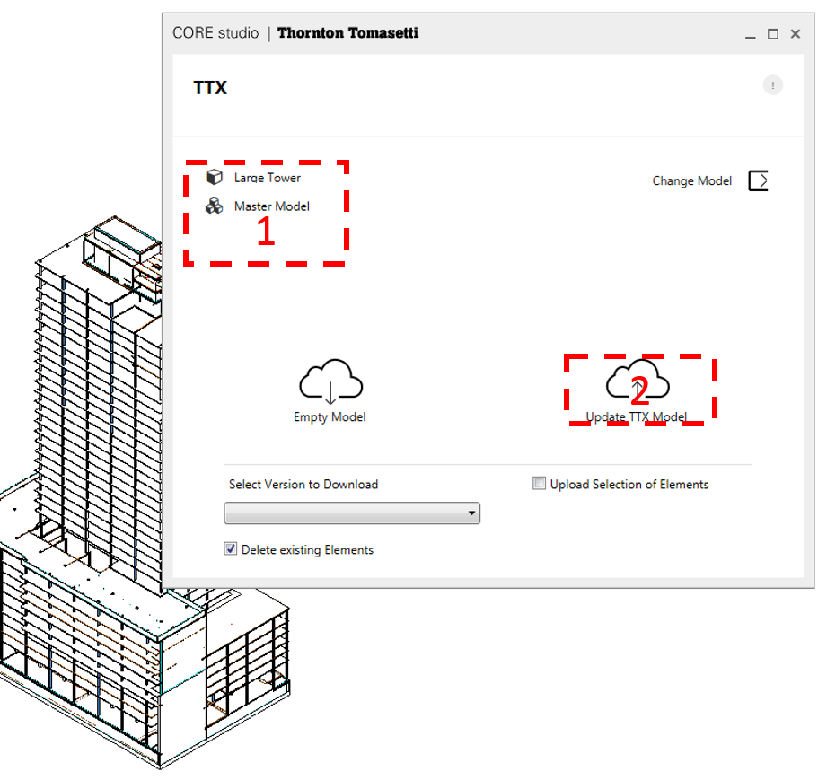
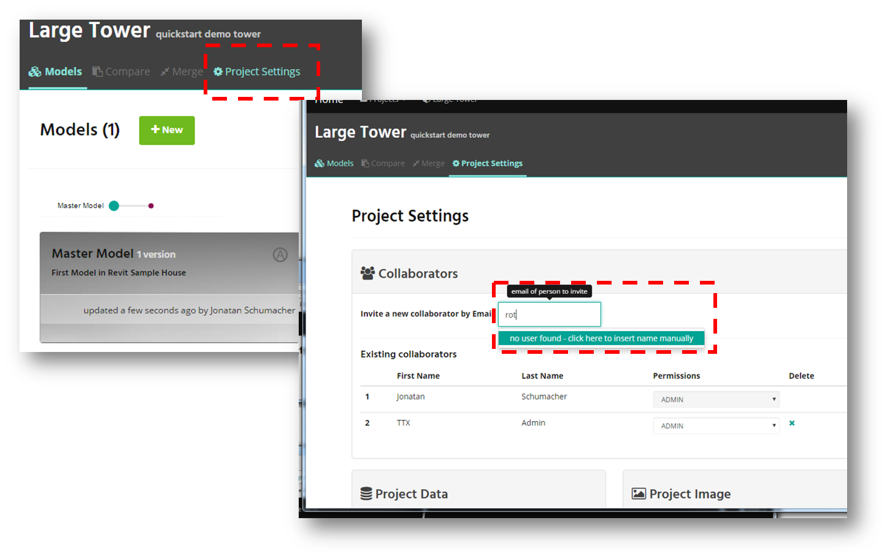

#Getting Started

##1. Create a User Account
Go to **https://ttx-webapp.herokuapp.com/** and sign up with your TT email address.
The TTX-Cloud web application works best in a Chrome browser, but also in Firefox and Internet Explorer (IE being the slowest of the three).

##2. Create a Project

Click the large green button to create a new project. Choose a name and description. For this demo, I name the project *Large Tower*.

**Project Name:** Should be a high level designation, such as the name of the TT Project. Analogous to the TT Project Number.

**Project Description:** A short meaningful description. 

When you create a new project, a new model named *Master Model* is automatically created.

##3. Upload a Model

TTX-Cloud uses the same UI for each of the seven desktop apps. In the desktop application (in my case Revit), select the project, and then the model (*Master Model*). Then press *Select Model*.

In the next dialog box, double-check the name of the project and model (1) and then press *Update TTX* to upload the model to the TTX-Cloud DB.
When prompted with additional dialogs, press *OK*.

When you now enter the project in the web UI, you will see that the *Master Model* contains one version now. We just created our first version of this model. Every time that we make changes to it, a new version is added for this model. 
##4. Add Collaborators
If you want to share this project with anybody, you can add a collaborator in the *Project Settings* tab  under *Collaborators*.
Type in the email of the person to add. If the person already has a TTX-Cloud account, select them from the dropdown. Else, you'll have to fill out their name and email. Then press *Save*. 
The user will receive an email invite to join your project.

Choose yoru permission levels depending on whether you want them to control the project (admin), up/download models (write) or just view models (read). More info on permissions [here](the_web_user_interface.md).

##5. Download the model (to a different application)
Launch the TTX-Cloud plugin from a different desktop application and select the  button.

