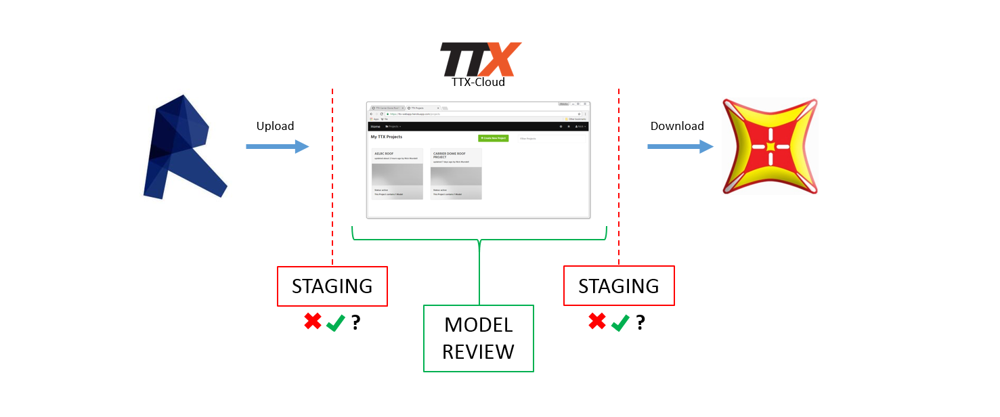
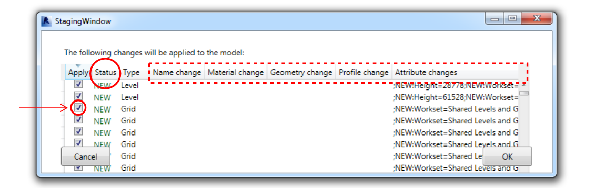

#Getting Started

##1. Create a User Account
Go to **https://ttx-webapp.herokuapp.com/** and sign up with your TT email address.
The TTX-Cloud web application works best in a Chrome browser, but also in Firefox and Internet Explorer (IE being the slowest of the three).

##2. Create a Project

The first step in working with TTX is the creation of a TTX Project. This is done directly from the web address listed above (**https://ttx-webapp.herokuapp.com/** ).

Click the large green button to create a new project. Choose a name and description. For this demo, I name the project *Large Tower*.

**Project Name:** Should be a high level designation, such as the name of the TT Project. Analogous to the TT Project Number.

**Project Description:** A short meaningful description. 

When you create a new project, a new model named *Master Model* is automatically created.

Once you've created a new Project, you are now able to upload a Model. This step is done via the desktop  side of things. Generally speaking, your first Project upload will be to the *Master Model*, giving your *Master Model* it's first *Version*. 

##3. Upload a Model

TTX-Cloud uses the same UI for each of the seven desktop apps. To launch the desktop app you should first review the installation section of this document to ensure TTX-Cloud will be available to you. Once installed, you will be able to launch the TTX-Cloud app directly from your platform (see installation for toolbar specific button locations). Note that TTX-Cloud RAM runs as an external .exe file, and requires no installation (and thus also wont be found in the RAM toolbar, as it is run from it's Start Menu location). 

Once you have the desktop application open (in my case Revit), select the project, and then the model (*Master Model*). Then press *Select Model*.

*Note: If you've only just created the Project, you may need to refresh the desktop side user interface for the Project you've created to appear in the list of your Projects.*

In the next dialog box, double-check the name of the project and model (1) and then press *Update TTX* to upload the model to the TTX-Cloud DB.
When prompted with additional dialogs, press *OK*.

*Note: If the Project/Model indicated in user interface #1. below is incorrect, you will need to use the 'Change Model' button, which will redirect you to the previous TTX-Cloud window which lists your available Projects. Choose the correct Project and Model (as per #3. 'Upload a Model') then 'Select Model' to be directed back to the up/down interface.* 

### What just happened (Upload Staging) / What's about to happen? (Download Staging)

 These two questions were asked by many TTX0.4 users, and TTX-Cloud looks to answer them via two steps in the process which are discussed in #5 + #6: 'Staging' and 'Model Review'. The goal of these two steps is to give the user more detail about the data that's being transferred between your platform and TTX-Cloud, and also between TTX-Cloud and your platform. Staging specifically allows the user to cancel the upload/download before making any changes to either the TTX-Cloud model (on upload) or to their local platform model (on download). 

##5. Staging
Staging takes place on both upload and download and allows the user to review the objects that are part of the specific upload/download before actually making the changes to the TTX-Cloud model (via an upload) or changes to your local model (via a download). The user can prevent individual changes to objects by unchecking the 'Apply' button, or stop the process all together with the 'Cancel' button. 

The key value identified in the Staging window is the 'Status' of an object: 

**NEW**: Object is being added to TTX-Model/Platform model for the first time.

**UPDATED**: Object that was already present in TTX-Model/Platform and has had some attribute (geometric or otherwise) altered by the last TTX-Cloud operation. Updated objects 

**DELETED**: Object that was present in TTX-Model/Platform before the update, but which during the update was not part of the data, and hence is about to be deleted.  

Once the Update TTX Model process is complete, you can head directly to the web UI to review what was just added to your *Master Model*.  

As you enter the Project in the web UI, you will see that the *Master Model* now contains one version. We just created our first version of this model!. Every subsequent time that we upload to this *Master Model* we are adding new *Versions* to the Model.  

##6. Model Review 
One of the key improvements of TTX-Cloud is giving users more transparency about the information contained within a TTX Project. With this in mind, once you've uploaded your first Model, we highly suggest spending a minute to review the state of this Model via the new web interface.

Model Review with the TTX-Cloud webpage is two-fold. First, when opening a model, the user is presented a tabular report about what the last update to a Model consisted of, whether object were added, deleted, updated or unchanged and the total number of these changes per object type. Users can then drill down into the type of change made, and further into the actual list of changes by object type. Secondly, you are able to access a 3D preview of the model in question directly from the Report interface. 

When reviewing large models it can be very useful to limit the scope of area, or object type you are interested in. In TTX-Cloud, these tools are available to you for both Report Review and 3D view via the 'Details' interface, and include the ability to limit the vertical range of objects (via 'Crop'), toggle on or off the object types being reported/displayed (via 'Type') and to toggle on or off objects by their 'Status'. 

##7. Add Collaborators  
If you want to share this project with a colleague or client, you can add a 'Collaborator' in the *Project Settings* tab  under *Collaborators*. Collaborators to a TTX-Cloud project are added to allow users that did not create the Project to interact with the Models and Versions that exist within a Project.

You are able to choose the permission levels of your chosen Collaborators depending on whether you want them to control the project (admin), up/download models (write) or just view models (read). More info on permissions [here](the_web_user_interface.md).

To add Collaborators to a Project: Open your Project, then access the *Project Settings* interface as seen below. Type in the email of the person to add. If the person already has a TTX-Cloud account, select them from the drop-down. Else, you'll have to fill out their name and email. Next stop is to define the Permission's level for the collaborator (see above)...and then press *Save*. 
The user will receive an email invite to join your project.

##8. Download the model (to a different application)
Launch the TTX-Cloud plugin from a different desktop application and select the  button.

