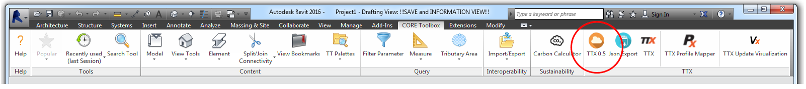
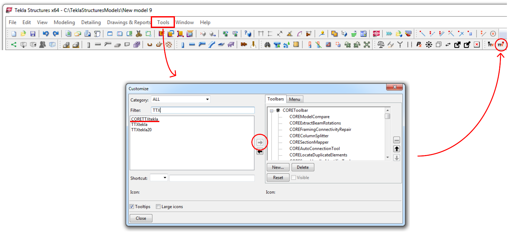
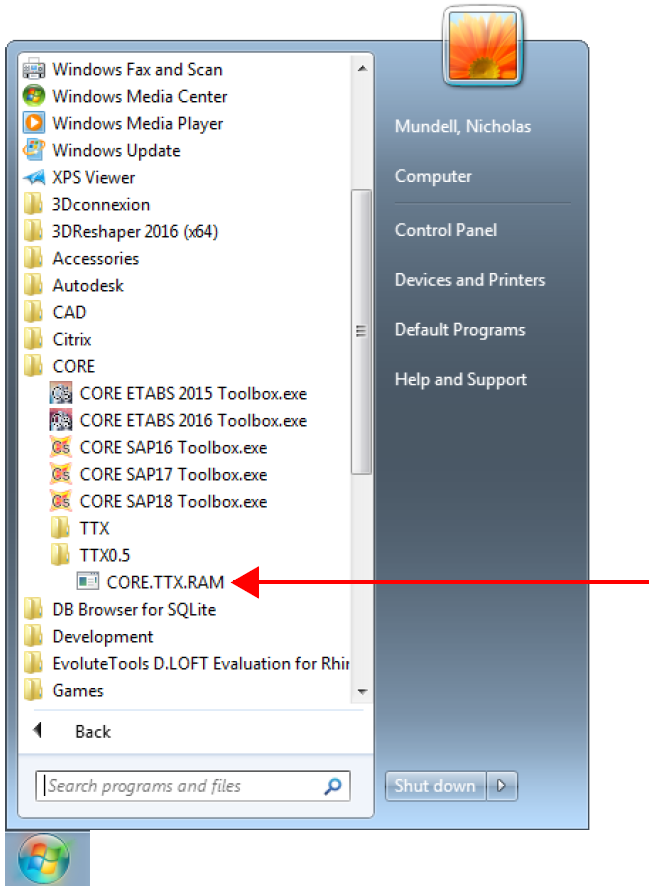
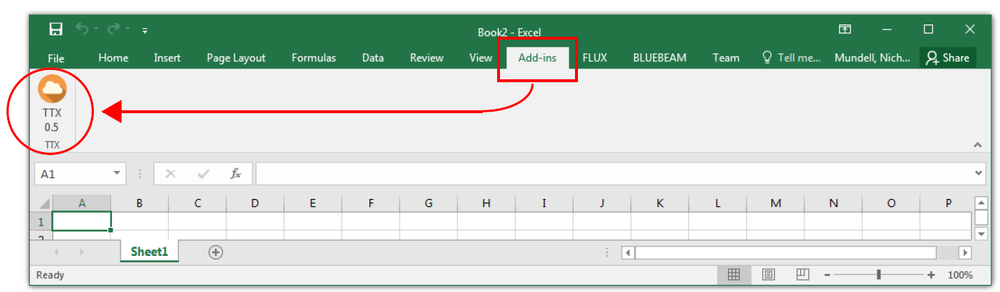
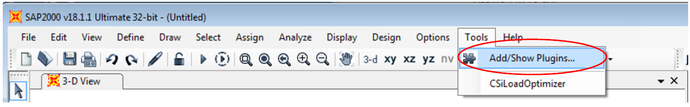
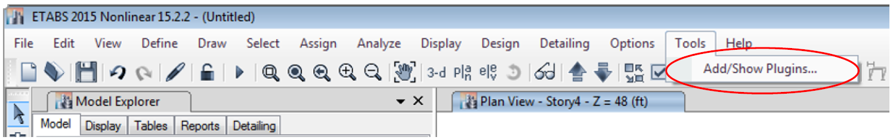
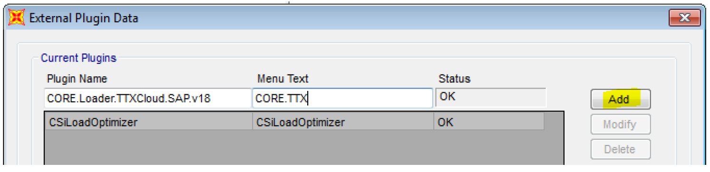
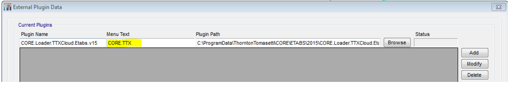
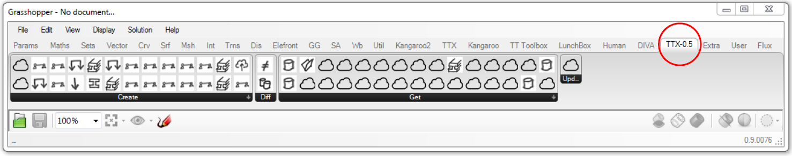

*
TTX-Cloud currently gets rolled out to early testers only. If you would like to have access to TTX-Cloud, please email Jonatan Schumacher*
# Installation of Desktop Plugins

## Revit 2016
The TTX-Cloud plugin should be present in your toolbar by default

## Tekla 20
You may need to add TTX0.5 to your toolabr, from the 'Tools>Customize' tab. Once added, you should see both TTX0.4 and 0.5 icons present.

##RAM
TTX RAM must be run as an external application (so no installation required!).
It can be found from the Windows Start menu, here:
* All Programs > CORE > TTX0.5

##Excel
Double click install of the .vsto file from this location
* P:\_Corp\CORE\Public\6_Tools\TTX05\Excel

## SAP 17/18 and Etabs 2015
You need to add TTX to your CSI platform via Tools > Add/Show Plugin...

###SAP 17/18:
Plugin Name = CORE.Loader.TTXCloud.SAP.v18
Menu Text = CORE.TTX” for Menu Text and click the Add button!
Note: The plug-in name is “CORE.Loader.TTXCloud.SAP.v17” for SAP2000 v17.

###Etabs 2015
Click Browse button and the select the file - C:\ProgramData\ThorntonTomasetti\CORE\ETABS\2015\CORE.Loader.TTXCloud.Etabs.v15.dll
Plugin Name = CORE.Loader.TTXCloud.Etabs.v15
Menu Text = CORE.TTX

##Grasshopper
TTX0.5 Grasshopper components should be installed automatically after restart of your computer.

