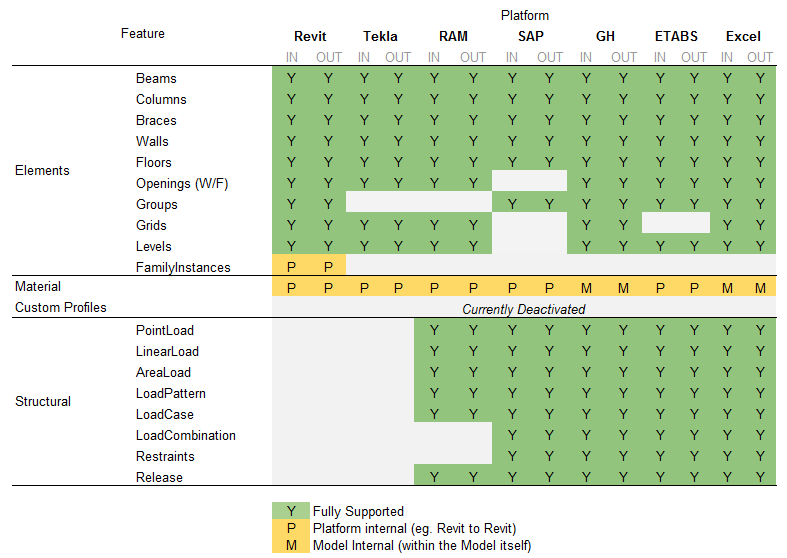
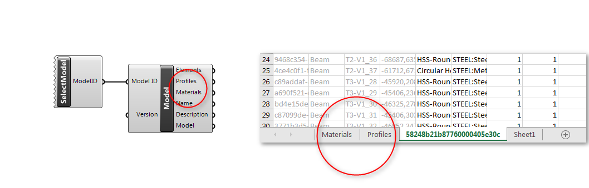

# Supported Elements
Konstru supports a range of new elements and platforms, you can read more about it in detail in the  [What has changed section](what_has_changed_from_ttx_04.md). The following tables shows all supported elements by platform and IN or OUT direction. Where IN = able to read from TTX to the platform and OUT = writing to TTX.

Interoperability for materials is still limited because each platform has a different level of detail on materials.  However you can easily read and write materials within each platform. For example Revit Materials will work fine from Revit to Revit.

Excel and Grasshopper work different on materials and profiles. They don't have materials internally. You can access all materials and profiles existing in the model on both platforms and use them to edit or create elements.
