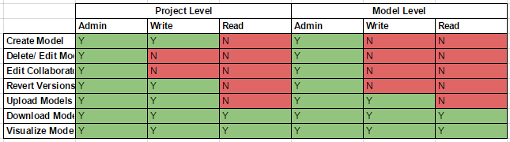

# The Web User Interface

## Introduction to the Web UI
https://youtu.be/Kd9Trjz9JDM?list=PLCGmyoTJ5YJ-56CxzMGEqFCyel0fF5VIv

## Collaborators/ Permissions
We have 3 permission levels (Admin, Write and Read) for both Projects and Models.

A Project Admin has the highest privilege. Typically, for any given project, there should only be one or two admins.
Collaborators with Project Write Permissions can create new models. They are automatically assigned admin rights for their created models.
Collaborators with Write access to models can upload new versions from any desktop application.
If you want to share the model with a client, for example, you can invite them with READ permissions. 

Refer to the matrix below for more info:

## Version Control for Models
At it's backend, Konstru has a powerful versioning database. This means that you can do operations such as comparing different versions of a model, or different models altogether, and also revert changes.

### Model Comparison
The Konstru Web Application provides functionality to let you compare various states of a model. This means that you can keep exact track of what has changed from one version of a model to the next. Or you can view the differences between two different models:
https://youtu.be/Sdr5jBhQk_4?list=PLCGmyoTJ5YJ-56CxzMGEqFCyel0fF5VIv

### Reverting to an earlier point in time
The following video explains how to rvert back to an earlier version of a model:
https://youtu.be/SW1WCRRmXCM?list=PLCGmyoTJ5YJ-56CxzMGEqFCyel0fF5VIv

