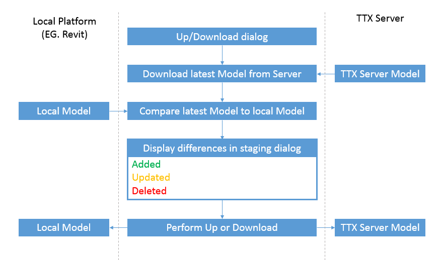
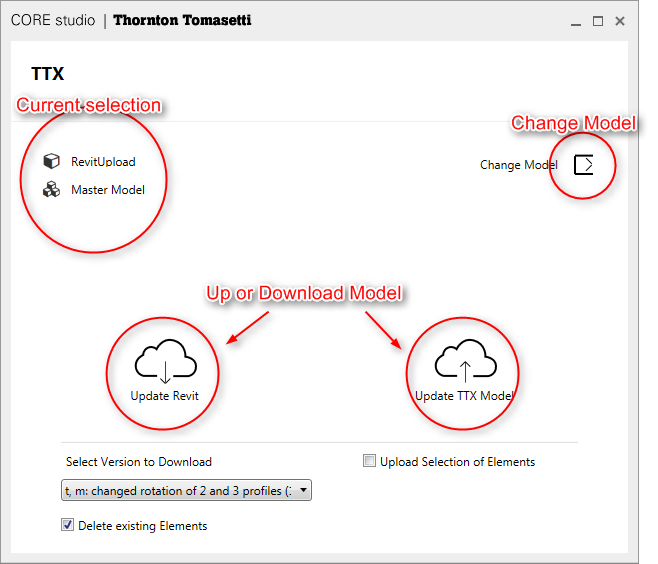
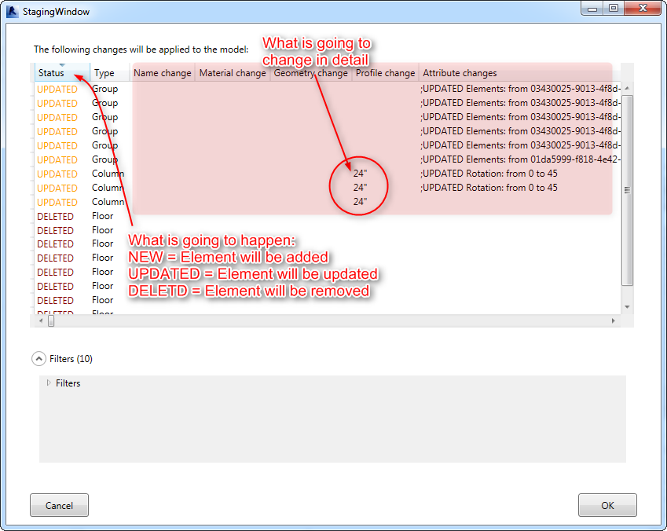

# Desktop Clients

## Upload a Model to Konstru
### Revit Upload Tutorial
https://youtu.be/d2pf8oAb3Kw

###Grasshopper Tutorial
https://youtu.be/ZB_b3LUBnFw

### Tutorial: Batch-edit model data with Excel
https://youtu.be/96-rm1MK9i8

## Desktop Clients Process
All clients are providing you a detailed overview about what is going to happen before any action is performed. After asking you if you want to Up or download, Konstru will always download the latest version of your model from the server and compare it against your local model. The differences are displayed in a staging dialog which helps you to take informed decisions about changes.

## Download a Model from Konstru to a desktop app
Every platform has the same UI. Once you click Konstru it will either prompt you to select a model or remember the model you selected last time. The screenshot below shows the key features of the Up/Download dialog:

After clicking Up or Download the process is always the same. Konstru will compare the model on the server against the model you are about to upload or download to and display the changes in the staging UI.
## The Staging UI
The staging UI tells you about the differences between your local model and the model on the server. It brings transparency by previewing each change that is going to happen. You can review the changes that are about to happen element by element. Every line represents one element. If you are in doubt or don't want to perform any changes you can click Cancel to stop the process.

The Status column is telling you about the action Konstru will perform. Adding, Deleting or Updating a single element. The 5 columns called change (Name change, etc - highlighted in red above) are telling you about each change in detail. In the example above 3 columns will change their profile to 24". 